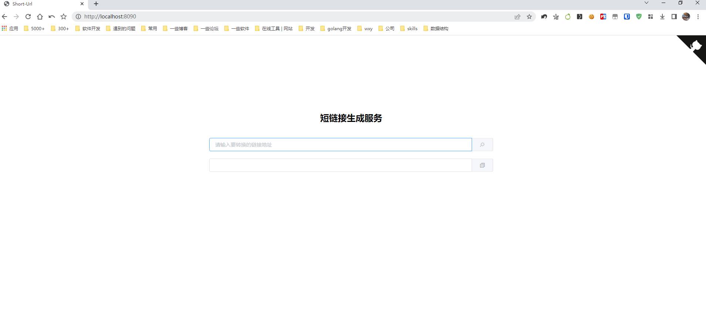
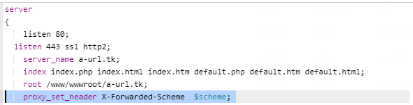

# 短链接生成服务
> 基于spring boot + H2 数据库实现的短链接生成服务(jdk1.8)

## ~~演示  <a href="http://a-url.tk" target="_blank">https://a-url.tk </a>~~
> 演示站为公共服务(不能保证永久链接)，如需使用请自行部署。



## 提供API  <a href="https://github.com/wxyShine/short-url/wiki/Short-Url-Api" target="_blank">wiki</a>  


## 部署方式一 🖥️
需要环境:jdk1.8

> <a href="https://github.com/wxyShine/short-url/releases" target="_blank">下载jar包</a> 直接启动 默认端口 8090

```shell
# 自行替换版本号
java -jar -Xms128m -Xmx512m -XX:PermSize=128M -XX:MaxPermSize=256M  short-url-版本号.jar

```

## 部署方式二 🐋
需要已经安装docker  <a href="https://docs.docker.com/engine/install/" target="_blank">参考</a>  
[docker hub](https://hub.docker.com/r/wxyshine/short-url)

> 使用docker方式部署 `latest`默认最新版本 可以指定<a href="https://hub.docker.com/r/wxyshine/short-url/tags" target="_blank">版本</a>

```shell
docker run -d -p 8090:8090 -v ~/.short-url:/root/.short-url --name short-url --restart=always wxyshine/short-url:latest
```     


> 如nginx 配置ssl后 生成的短链接不带https  
> 在nginx 配置加上 `proxy_set_header X-Forwarded-Scheme  $scheme;`  


